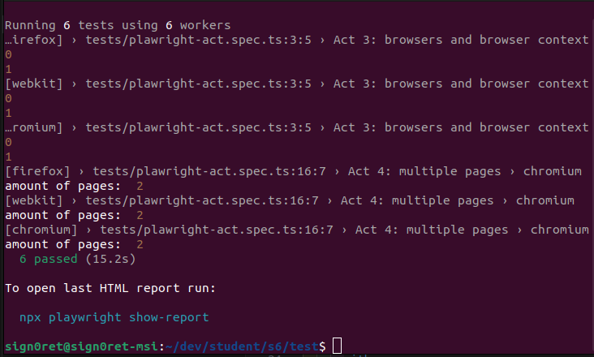
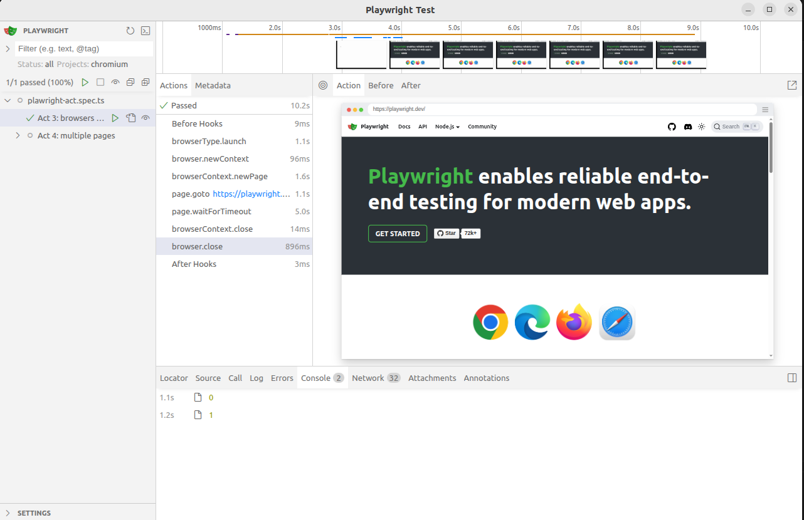
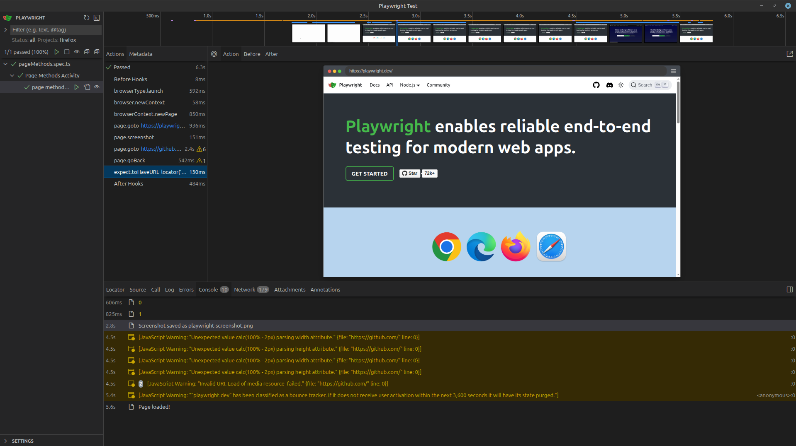

# **Tarea Quality Assurance: Plawright**

## Equipo #46

Carlos Iván Armenta Naranjo - A01643070

Jorge Javier Blásquez Gonzalez - A01637706 

Adolfo Hernández Signoret - A01637184

Arturo Ramos Martínez - A01643269

Moisés Adrián Cortés Ramos - A01642492

Bryan Ithan Landín Lara - A01636271

## 🚀 To run use:

```bash
git clone https://github.com/Sign0ret/playwright-activity.git
```
```
cd playwright-activity
```
```
npm install
```
```
npx playwright test
```

```
npx playwright test --ui
```
#### act 03 in UI


#### act 04 in UI


#### act 05 in UI
